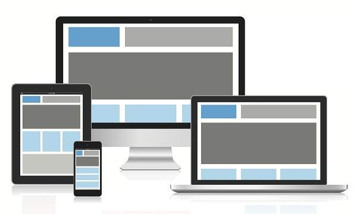

# Nội dung Buổi 6: CSS Responsive

## 1. Responsive

Responsive là một tính từ dùng để chỉ một website có khả năng hiển thị độ tương thích trên mọi kích thước của trình duyệt.



- **Sử dụng Media Query**

```css
/* Media Query Syntax */
@media not|only mediatype and (expressions) {
  CSS-Code;
}
```

| Value  | Description                                                        |
| ------ | ------------------------------------------------------------------ |
| all    | Được sử dụng cho tất cả các loại thiết bị                          |
| print  | Được sử dụng cho máy in                                            |
| screen | Được sử dụng cho màn hình máy tính, máy tính bảng, điện thoại v.v. |
| speech | Được sử dụng cho trình đọc màn hình "đọc" trang thành tiếng        |

Ví dụ:

```css
@media only screen and (max-width: 600px) {
  body {
    background-color: lightblue;
  }
}
```

- **Breakpoint**

```scss
/* Tablet */
@media screen and (min-width: 768px) and (max-width: 1024px) {
  @content;
}

/* Small tablet */
@media screen and (min-width: 480px) and (max-width: 768px) {
  @content;
}

/* Mobile  */
@media screen and (min-width: 320px) and (max-width: 480px) {
  @content;
}
```

## 2. Nâng cao

- [HTML Tags](https://htmlreference.io/)
- [Emmet](https://docs.emmet.io/cheat-sheet/)

## 3. Ôn tập
